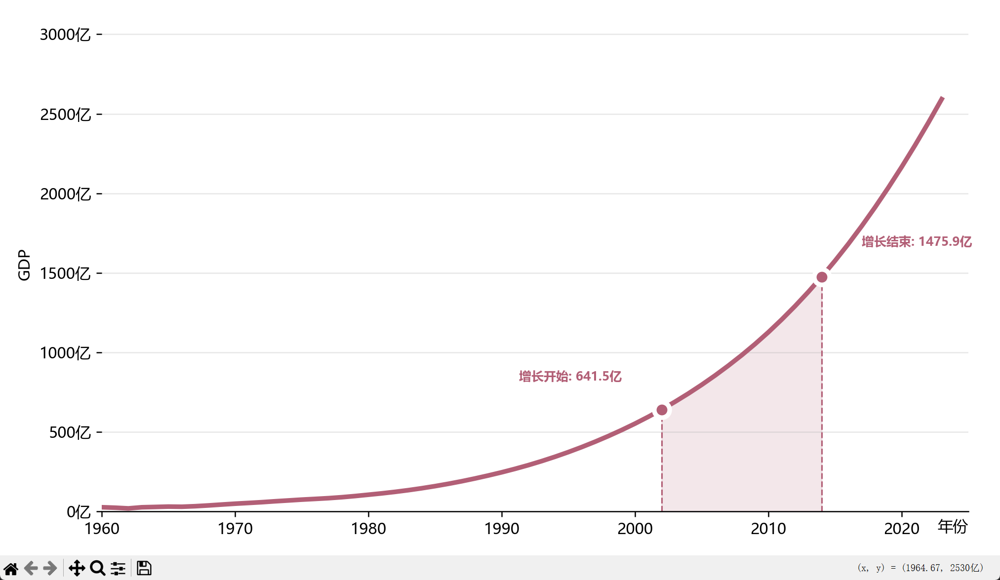

- prompt
用Python Matplotlib绘制**学术简洁风时间序列折线图**，要求如下：
1. 数据来源：读取数据
   - 绘制单折线，自定义线宽、主题色
   - 标记2个关键节点（开始/结束）：白色描边实心散点+垂直虚线+文字标注（含数值）
   - 自动填充关键节点之间的区域阴影（低透明度）
3. 样式规范：
   - 中文正常显示（微软雅黑），隐藏顶部/右侧/左侧边框，仅保留水平网格线
   - 坐标轴：X轴自定义年份刻度，Y轴自动格式化数值单位（如：亿）
   - 标注文字加粗、配色与折线统一，位置避开折线不遮挡
4. 布局：自动适配坐标轴范围，顶部预留空间防止文字截断，紧凑布局
5. 输出：高清绘图，代码带注释、可直接运行，支持替换关键节点索引、颜色、单位

```py
import matplotlib.pyplot as plt
import matplotlib.ticker as ticker
import pandas as pd

plt.rcParams['font.sans-serif'] = ['SimHei']
plt.rcParams['axes.unicode_minus'] = False

def create_chart(ax):
    df = pd.read_csv("data.csv")
    x = df["年份"].values
    cols = ["GDP总量", "第一产业", "第二产业", "第三产业"]
    y = df[cols].values
    colors = ["#b25f76", "#f6b014", "#7674b9", "#90abd4"]

    for i in range(4):
        ax.plot(x, y[:, i], label=cols[i], linewidth=3, color=colors[i])

    ax.set_yscale("log")  # 对数坐标
    ax.fill_betweenx([y.min(), y.max()], 2000, 2014, alpha=0.1, color=colors[0])
    ax.legend(loc="upper left", ncol=2)
    ax.set_xlabel("年份")
    ax.grid(axis="y", alpha=0.3)
    ax.spines[["top", "right"]].set_visible(False)

if __name__ == "__main__":
    fig, ax = plt.subplots(figsize=(10, 5), dpi=150)
    create_chart(ax)
    plt.tight_layout()
    plt.show()


```
