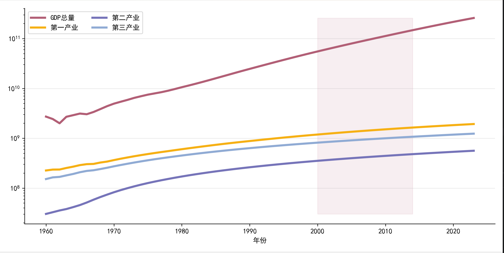

- Prompt
用Python Matplotlib+Pandas绘制**学术极简风多系列时间序列折线图**，严格遵循以下要求：
1. 数据处理：读取数据
2. 核心样式：
   - 多组折线并行绘制，自定义专属配色、统一线宽
   - Y轴设置为**对数坐标(log)**，适配数值跨度大的经济/时序数据
   - 绘制指定年份/时间区间的垂直阴影填充（低透明度），突出分析区间
3. 图表规范：
   - 中文正常显示（黑体SimHei），负号正常显示
   - 隐藏顶部、右侧边框，仅保留水平网格线
   - 图例左上角排列、双列展示，简洁不拥挤
4. 布局：自动紧凑布局，高清输出，代码带注释、可直接运行
5. 自定义项：折线颜色、指标列名、阴影填充区间、对数坐标开关

```pycon
import matplotlib.pyplot as plt
import matplotlib.ticker as ticker
import pandas as pd

plt.rcParams['font.sans-serif'] = ['SimHei']
plt.rcParams['axes.unicode_minus'] = False

def create_chart(ax):
    df = pd.read_csv("data.csv")
    x = df["年份"].values
    cols = ["GDP总量", "第一产业", "第二产业", "第三产业"]
    y = df[cols].values
    colors = ["#b25f76", "#f6b014", "#7674b9", "#90abd4"]

    for i in range(4):
        ax.plot(x, y[:, i], label=cols[i], linewidth=3, color=colors[i])

    ax.set_yscale("log")  # 对数坐标
    ax.fill_betweenx([y.min(), y.max()], 2000, 2014, alpha=0.1, color=colors[0])
    ax.legend(loc="upper left", ncol=2)
    ax.set_xlabel("年份")
    ax.grid(axis="y", alpha=0.3)
    ax.spines[["top", "right"]].set_visible(False)

if __name__ == "__main__":
    fig, ax = plt.subplots(figsize=(10, 5), dpi=150)
    create_chart(ax)
    plt.tight_layout()
    plt.show()

```
