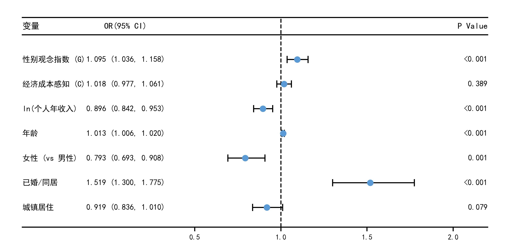

- Prompt
请用Python的Matplotlib库绘制**学术出版级森林图**，严格遵循以下要求：
1. 图表类型：回归优势比(OR)森林图，搭配[提供数据变量名]的三线表样式
2. 核心数据：[替换为你的变量名列表、OR值、95%置信区间上下限、P值列表]
3. 视觉样式：
   - 误差线：黑色、带线帽(capsize=5)、线宽1.5；效应值点：#5B9BD5蓝色实心圆点
   - 垂直虚线：OR=1无效假设参考线，黑色虚线
   - 表格：学术三线表（顶线、表头线、底线），无默认坐标轴
   - 字体：支持中文（SimHei），表头加粗，字号规范
4. 布局：变量从上到下排列，X轴为优势比（刻度0.5/1.0/1.5/2.0），手动绘制坐标轴
5. 输出要求：高清300dpi，figsize=(10,5)，紧凑布局，保存为png图片，代码带注释、可直接运行
6. 模型：[替换为你的模型，如：有序Logit回归主模型/二元Logit回归]


```py
# -*- coding: utf-8 -*-
"""
复刻学术森林图样式：结合数据表与误差线图
数据来源：表4-12 有序Logit优势比 (主模型)
"""
import matplotlib.pyplot as plt
import numpy as np

# ==========================================
# 1. 准备数据
# ==========================================
# 提取自 表4-12
labels = ['性别观念指数 (G)', '经济成本感知 (C)', 'ln(个人年收入)', '年龄', '女性 (vs 男性)', '已婚/同居', '城镇居住']
ors = [1.095, 1.018, 0.896, 1.013, 0.793, 1.519, 0.919]
ci_low = [1.036, 0.977, 0.842, 1.006, 0.693, 1.300, 0.836]
ci_high = [1.158, 1.061, 0.953, 1.020, 0.908, 1.775, 1.010]
p_vals = ['<0.001', '0.389', '<0.001', '<0.001', '0.001', '<0.001', '0.079']

# 反转数组，使第一行数据（核心变量）显示在图像最上方
labels = labels[::-1]
ors = ors[::-1]
ci_low = ci_low[::-1]
ci_high = ci_high[::-1]
p_vals = p_vals[::-1]

# 格式化 OR 和 CI 字符串
or_strings = [f"{o:.3f} ({l:.3f}, {h:.3f})" for o, l, h in zip(ors, ci_low, ci_high)]

# Y轴对应的垂直坐标位置
y_pos = np.arange(len(labels))

# ==========================================
# 2. 全局与画布设置
# ==========================================
# 设置中文字体（Windows系统推荐SimHei，Mac系统推荐Arial Unicode MS）
plt.rcParams['font.sans-serif'] = ['SimHei', 'Arial Unicode MS']
plt.rcParams['axes.unicode_minus'] = False

fig, ax = plt.subplots(figsize=(10, 5), dpi=300)

# 定义各列在 X 轴上的绝对位置
x_var = -0.5    # 变量名称列 (左对齐)
x_or = 0.1      # OR(95% CI) 列 (居中)
x_pval = 2.2    # P Value 列 (右对齐)

# ==========================================
# 3. 绘制核心森林图 (误差线与点)
# ==========================================
# 计算误差区间大小
xerr_lower = np.array(ors) - np.array(ci_low)
xerr_upper = np.array(ci_high) - np.array(ors)

# 绘制带有线帽的黑色误差线与蓝色实心圆点（复刻目标图片样式）
ax.errorbar(ors, y_pos, xerr=[xerr_lower, xerr_upper],
            fmt='o', color='#5B9BD5', ecolor='black',
            elinewidth=1.5, capsize=5, capthick=1.5, markersize=8, zorder=3)

# ==========================================
# 4. 绘制文本与表格数据
# ==========================================
for i in range(len(labels)):
    # 绘制每一行的数据文字
    ax.text(x_var, i, labels[i], ha='left', va='center', fontsize=11)
    ax.text(x_or, i, or_strings[i], ha='center', va='center', fontsize=11)
    ax.text(x_pval, i, p_vals[i], ha='right', va='center', fontsize=11)

# 表头 Y 坐标定位
header_y = len(labels) + 0.2

# 绘制表头加粗文字
ax.text(x_var, header_y, '变量', ha='left', va='bottom', fontsize=12, fontweight='bold')
ax.text(x_or, header_y, 'OR(95% CI)', ha='center', va='bottom', fontsize=12, fontweight='bold')
ax.text(x_pval, header_y, 'P Value', ha='right', va='bottom', fontsize=12, fontweight='bold')

# ==========================================
# 5. 绘制边框与刻度线 (学术三线表)
# ==========================================
# 定义三条横线的 Y 坐标
line_top = header_y + 0.5
line_mid = header_y - 0.2
line_bot = -0.8

# 画三条水平黑线
ax.plot([x_var, x_pval], [line_top, line_top], color='black', linewidth=1.5)
ax.plot([x_var, x_pval], [line_mid, line_mid], color='black', linewidth=1.5)
ax.plot([x_var, x_pval], [line_bot, line_bot], color='black', linewidth=1.5)

# 画贯穿图表的虚线 (OR=1 无效假设参考线)
ax.plot([1.0, 1.0], [line_bot, line_top], color='black', linestyle='--', linewidth=1.5, zorder=1)

# 关闭所有默认的坐标轴和边框
ax.axis('off')

# 手动在下方画 X 轴刻度和文字 (匹配数据的跨度 0.5 ~ 2.0)
ticks = [0.5, 1.0, 1.5, 2.0]
for t in ticks:
    # 画刻度的小竖线
    ax.plot([t, t], [line_bot, line_bot - 0.15], color='black', linewidth=1.5)
    # 写刻度数字
    ax.text(t, line_bot - 0.3, f"{t:.1f}", ha='center', va='top', fontsize=10)

# ==========================================
# 6. 图幅范围与输出
# ==========================================
# 锁定显示范围，确保文字不会被切断
ax.set_xlim(x_var - 0.1, x_pval + 0.1)
ax.set_ylim(line_bot - 0.8, line_top + 0.5)

plt.tight_layout()
plt.savefig('custom_forest_plot_publication.png', dpi=300, bbox_inches='tight')
plt.show()
```
